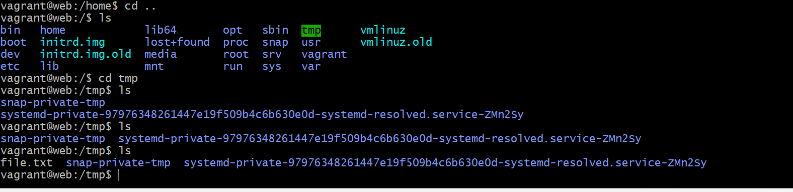

# IaC

### What is infrastructure as code?
Infrastructure as code (IaC) is a way of managing computer infrastructure, like servers and networks, by using machine-readable files to define and automate the setup and configuration of these resources. Instead of manually configuring hardware devices, IaC allows developers to use code to define their infrastructure, which can be version-controlled, tested, and deployed like software code. This makes infrastructure deployment faster, more reliable, and easier to scale up or down as needed. Popular tools for implementing IaC include Terraform, Ansible, Puppet, Chef, and CloudFormation.

### What coding languages are used?

There is no one specific coding language used for Infrastructure as Code (IaC). Instead, IaC can be implemented using a variety of programming languages, configuration files, or scripts depending on the tool being used.

Some popular programming languages used for IaC include:

HashiCorp Configuration Language (HCL) - used in HashiCorp's Terraform
YAML - used in Ansible and Kubernetes
JSON - used in AWS CloudFormation
Ruby - used in Chef


### Terraform and Ansible:

Terraform and Ansible are two popular Infrastructure-as-Code (IaC) tools that are used to manage and automate IT infrastructure. 

Terraform is a tool for building, changing, and versioning infrastructure safely and efficiently.
Terraform allows you to create infrastructure by defining resources, such as servers, networks, and storage, in code. It uses a state file to track the current state of the infrastructure and manages dependencies between resources to ensure that they are created and updated in the correct order. Terraform is ideal for provisioning and managing infrastructure that will be deployed to the cloud.

Ansible, on the other hand, is a tool for automating the configuration and management of systems. It provides a simple, human-readable language for defining tasks that can be executed on remote hosts. Ansible uses an agentless architecture, which means that it does not require any software to be installed on the managed hosts. 


### Why Use Infrastructure as Code?
In the early 2000s, managing an IT infrastructure was a highly manual and complex process for big companies. Experts had to physically install and configure servers and other types of hardware, which was a slow, inconsistent and costly way to manage IT. 

With IaC, there’s no need for this kind of manual configuration. Instead, DevOps teams can automatically manage, monitor and provision resources. By using IaC, the provisioning code becomes easy to edit, copy and distribute.

Notice that, like any other software development project, developers must maintain version control, test iterations and limit deployments. So, even though IaC is a great approach for automating complex manual processes, it also includes new tools and overhead for the developers.


# Ansible

### Creating an environment for Ansible using Vagrant

Firstly we create three virtual machines as shown in the diagram 1 for our ansible controller and the other 2 for our app and db VM.

Our vagrantfile must contain the following code:

 # ansible-tech201


# -*- mode: ruby -*-
 # vi: set ft=ruby :
 
 # All Vagrant configuration is done below. The "2" in Vagrant.configure
 # configures the configuration version (we support older styles for
 # backwards compatibility). Please don't change it unless you know what
 
 # MULTI SERVER/VMs environment 
 #
 Vagrant.configure("2") do |config|
 # creating are Ansible controller
   config.vm.define "controller" do |controller|
     
    controller.vm.box = "bento/ubuntu-18.04"
    
    controller.vm.hostname = 'controller'
    
    controller.vm.network :private_network, ip: "192.168.33.12"
    
    # config.hostsupdater.aliases = ["development.controller"] 
    
   end 
 # creating first VM called web  
   config.vm.define "web" do |web|
     
     web.vm.box = "bento/ubuntu-18.04"
    # downloading ubuntu 18.04 image
 
     web.vm.hostname = 'web'
     # assigning host name to the VM
     
     web.vm.network :private_network, ip: "192.168.33.10"
     #   assigning private IP
     
     #config.hostsupdater.aliases = ["development.web"]
     # creating a link called development.web so we can access web page with this link instread of an IP   
         
   end
   
 # creating second VM called db
   config.vm.define "db" do |db|
     
     db.vm.box = "bento/ubuntu-18.04"
     
     db.vm.hostname = 'db'
     
     db.vm.network :private_network, ip: "192.168.33.11"
     
     #config.hostsupdater.aliases = ["development.db"]     
   end
 
 end 


Inside directory with vagrantfile Vagrant up we do this in GitBash
then
`Vagrant ssh controller` and then `Vagrant ssh app` and then `Vagrant ssh db` after running update and upgrade in all these VM afterwards we go back the the controller VM and from there we run the following in order:

`sudo apt-get install software-properties-common`
then 
`sudo apt-add-repository ppa:ansible/ansible`
then
`sudo apt-get install ansible -y`

next we check the version of ansible using `sudo ansible --version`

next we need to test ansible controller and check does it have everything to communicate with the different nodes as shown in the image.
we then `cd /etc` then `cd /ansible` 
Now we need to see if we can communicate with the two other machines APP and DB by using `ssh vagrant@192.168.33.10`
when we do this the controller will send a request to ssh in, we will need to do this using a password but it will be denied as there is no key nor does the other node expect anything.

After this we need to SSH into our web virtual environment using `ssh vagrant@192.168.33.10` this is the IP of our web VE: we run this command to check the communication between `controller` and `db` and also helps us copy the key and use the password from now on as vagrant and ideally the password should be changed especially when running globally

next we enter `sudo ansible -m ping web` then `sudo ansible -m ping web --ask-vault-pass` and thi shouldn't work as it goes to our post file and looks for these files which are not there yet.

next we enter `sudo nano hosts` and enter 
then we enter this inside `192.168.33.10 ansible_connection=ssh ansible_ssh_user=vagrant ansible_ssh_pass=vagrant`
`sudo ansible -m ping all --ask-vault-pass`

All of the previous commands will probably fail as we need to disable a key we do this by entering `sudo nano ansible.cfg` then adding `host_key_checking = false` right under `[default]` 
then we run `sudo ansible -m ping web` and it should now work.

and then we should get the following response:

``` [DEPRECATION WARNING]: Distribution Ubuntu 18.04 on host 192.168.33.10 should use
/usr/bin/python3, but is using /usr/bin/python for backward compatibility with prior
Ansible releases. A future Ansible release will default to using the discovered platform
 python for this host. See
https://docs.ansible.com/ansible/2.9/reference_appendices/interpreter_discovery.html for
 more information. This feature will be removed in version 2.12. Deprecation warnings
can be disabled by setting deprecation_warnings=False in ansible.cfg.
192.168.33.10 | SUCCESS => {
    "ansible_facts": {
        "discovered_interpreter_python": "/usr/bin/python"
    },
    "changed": false,
    "ping": "pong"
}
```


Currently, we have established SSH connections between the web and db virtual machines using Linux commands without involving Ansible. This involves using Linux SSH command to connect from one Linux machine to another.
However, with Ansible, we can verify if these virtual machines are able to communicate with each other. This can be done by executing an ad-hoc Ansible command called "ping".

`sudo ansible -m ping web`

### Setting up play books:

Moving forward, our focus will be on creating Playbooks which demonstrate the true capabilities of Ansible. We'll begin with a simple task of verifying the status of communication between the Controller and the web VM (Agent node).

we simply enter the following command `sudo ansible -m ping web`

The `sudo ansible -m ping web` command is an example of an ad hoc command in Ansible. With ad hoc commands, we can execute tasks like pinging other machines without having to create a script for it. Ansible offers many modules, such as the ping module, which provide information about a machine without requiring an SSH login.

Ad hoc commands are highly useful and powerful, as they allow us to obtain information or execute commands on a machine without needing to log in via SSH. Additionally, ad hoc commands can be used to perform the same action on multiple machines at once.


At present, our virtual machines are empty since we just created them, and there is no data or software installed in them yet. However, in a real-world situation, when we perform server patching, it's possible that we may not know which operating system is running on each machine.
Another ad hoc command is: `sudo ansible web -a "uname -a"` :this tells us the name of all our VM's

Using the command `sudo ansible all -a "date"` we are able retrieve information about the time zone in which a specific node is running, without needing to log in via SSH. This ad-hoc command can be used to obtain the results of the 'date' command for all nodes that are communicating with the Controller, even though we only have one (web) at the moment.

In situations where we need to check the available memory within a machine, such as when we need to run an update with high requirements, we can use the command `sudo ansible web -a "free -m"` ,this command outputs the available and used memory within the VM, without requiring an SSH login.

To check if a file exists within a VM, we can use the command `sudo ansible web -a "ls -a"`. This command shows us all the hidden or existing files within the VM, eliminating the need for manually checking the VM.

https://docs.ansible.com/ansible/latest/command_guide/intro_adhoc.html This website has many other Ad 

### Creating a file in controller and copying it to web VM using ad hoc:

To create a file named "file.txt", we can use any text editor for us we used `nano` and add a some text to it. Once the file is created, you can copy it within your web environment using the following command: `sudo ansible web -m copy -a '"src=/etc/ansible/file.txt dest=/tmp/"`. If the command runs successfully, you will be able to see the copied "file.txt" at the specified path on the web VM.




### Making a Playbook

To configure VMs with the necessary dependencies for monolith architecture, you can use Playbooks instead of manually SSH-ing into the VMs. This approach enables you to automate the process and make the configuration consistent across multiple VMs.

As shown in the image below:


### Web VM
To configure the web VM, the first step is to provision it with the app folder containing the application code. To accomplish this, we can create a Playbook that outlines the necessary steps for provisioning the VM.

First we need to provision the web vm with the app

```
# create a playbook to copy the TECH201-Virtualisation repo in web machine

# let`s add --- 3 dashes  to start a YAML file

---

# where do we want this playbook to run
# add the name of the host
- hosts: web
# this will check the ping


# find the facts
  gather_facts: yes
# yes can also be replaced with true


# we need admin access
  become: true

# we have the admin acess, now we can add the instructions to perform the task
# clone github repo in web VM
  tasks:
  - name: Cloning GIT
    git:
      repo: https://github.com/belalb100/tech201_virtualisation.git
      dest: /home/app/app
      clone: yes
# this command will clone the repo on our web VM
```


```
# create a playbook to configure nginx web server in web machine 

# let's add --- 3 dashes to start a YAML file

---

# where do we want this playbook to run
# add the name of the host
- hosts: web
#this will check the ping

# find the facts
  gather_facts: yes
# yes can also be replaced with true

# we need admin access
  become: true
 
# we have the admin access, now we can add the instructions to perform the task
# install nginx in web machine
  tasks:
  - name: Install Nginx in web-server
    apt; pkg=nginx state=present

# present can be replaced with absent if we want to make sure it is not running
# this command will install nginx and ensure that nginx is running  - status is active/running
```

dcdsdcsd

--- 

# where do we want this playbook to run
# add the name of the host
- hosts: web # find the facts
  gather_facts: yes
# we need admin access
  become: true # add instructions to perform the task
# install nginx in web machine
  tasks:
  - name: Install Nginx in web-server
    apt: pkg=nginx state=present
# ensure that nginx is running - status is running


MongoDB playbook:


```
# Create a playbook to configure/install mongodb in our db machine
# name of the host/node
---

- hosts: db
# let's get some facts

  gather_facts: yes

# Admin access
  become: true

# add instructions - tasks
  tasks:
  - name: install mongodb most latest version
    apt: pkg=mongodb state=present
```


